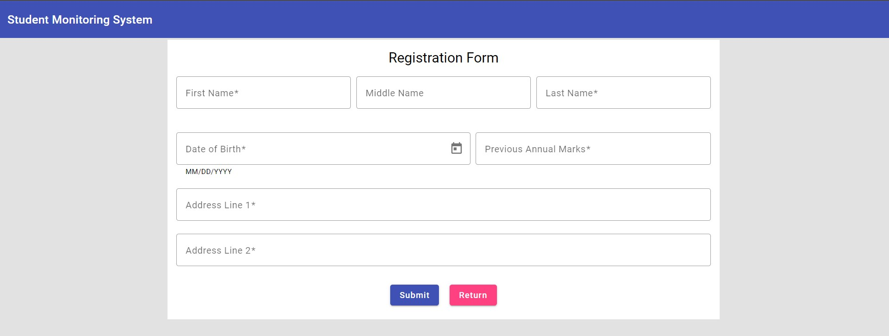

# Student Monitor UI

This is a basic UI designed and integrated with the [student monitor microservice](https://github.com/vishwaprotim/monitor). It uses -

1. **Angular 16** - UI framework for designing SPA.
2. **Angular Material** - For designing UI components. Angular Material helps create components easily with minimum efforts. Check it [here](https://material.angular.io/)
3. **Angular Reactive Forms** - Reactive forms provide more control through code compared to Template driven forms.

## Setting up the Project

This project uses Angular 16. Make sure you have Node npm installed. You can download node from [here](https://nodejs.org/en).

Once node is installed, install the Angular CLI by running this command:

```shell
npm install -g @angular/cli
```

If you need more details, check the [Angular documentation](https://angular.io/guide/setup-local).

After installing Angular, go to the project directory and run this command to start the UI server:

```shell
ng serve
```

Once the server is up, the page can be accessed at [http://localhost:4200](http://localhost:4200/)

### Important

Ensure the backend monitor api is running. Check this [ReadMe](https://github.com/vishwaprotim/monitor#readme) to know more.

### Screenshots:

Home Screen -


Registration Form -


Student Details Screen -


### Helpful References:

1. Creating Angular Project with Microservice Integration | [YouTube](https://www.youtube.com/watch?v=9TG6nOPJJ3Y&t=1869s&ab_channel=LearnCodeWithDurgesh)
2. Creating Reactive Forms in Angular | [Telerik](https://www.telerik.com/blogs/angular-basics-creating-dynamic-forms-using-formarray-angular)
